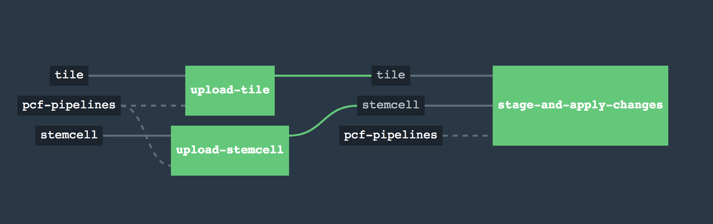

# pcf-pipelines-selective-deploy

This project is a minimal-compelling product & demonstration of automated selective-deploys for both products and stemcells for a single foundation. New product patch version comes out? Download/stage/selective-deploy it. New stemcell comes out for a product? No problem. Download/upload the latest stemcell, _selectively apply the stemcell to a single product_, then do a selective deploy on *only* that product.

Not only can we take the latest stemcells (previously we just waited until a new tile version came out & it bumped the stemcell for us), we can now selectively deploy those stemcells on a product-by-product basis.

For a single product change-- even something small like newrelic-- it used to take between ~6-20 hours because all the smoke tests & such had to run for each tile. We can now take upgrades, automatically, in as little as 10 minutes. And big changes, like rolling out new version of PAS or stemcells to MySql, still take less time. Minor example: in sandbox we went from PAS 2.1.2 --> 2.1.3 in ~22 minutes.

## disclaimer

**This is experimental**, don't go running it in prod, yadda yadda yadda, **everything is subject to change**, I'm not going to maintain this repo long-term, etc. etc., I take no responsibility for this code totally screwing up your foundation, your life, your marriage, etc.

[Some of the logic used in pipeline tasks requires an unreleased version of `om-linux`; it’s not ready for actual consumption](https://github.com/pivotal-cf/om/issues/158), but hopefully this project demonstrates what can be done. Also huge props to the `om-linux` team. They're making our lives as developers _objectively_ better.

## usage

Go to `foundations/`, fill out a folder with `tiles/` and `params.yml`. Each `product-name.yml` represents, as you might imagine, a product in your foundation. Create a `*.yml` file & fill out the params for the products you want to have the pipeline automatically upgrade. Then run `./set-pipelines <foundation>` to get those pipelines up into Concourse.

(`tiles-jail/` just holds tiles that I don't want to create pipelines for yet. Once you're ready to create a pipeline for it, move the tile into `tiles/`)

## ideas / concerns

If you've got feedback, questions, concerns, ideas, praise, vitriol, etc., [please create an issue](https://github.com/aegershman/pcf-pipelines-selective-deploy/issues). Any comments are welcome.
